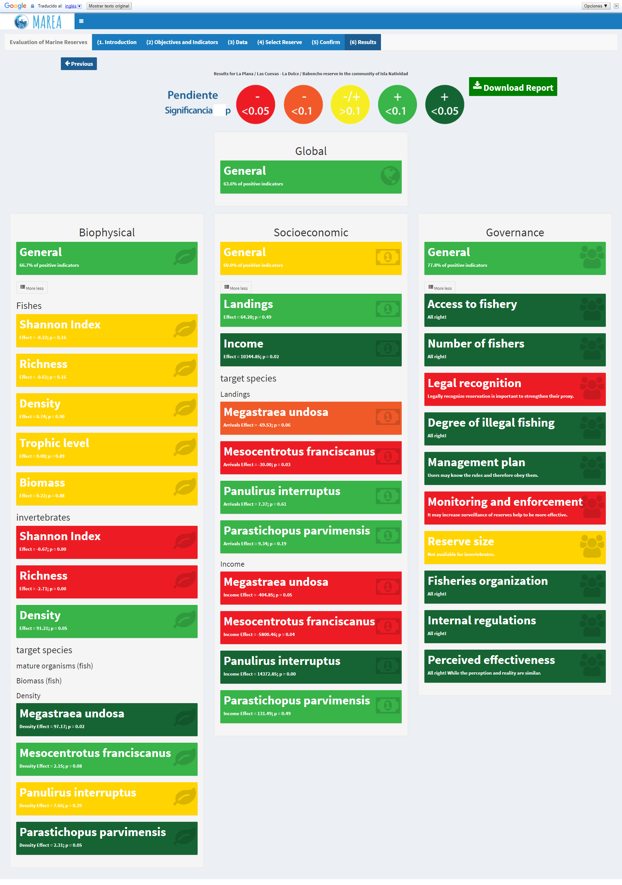

```{r setup, include=FALSE}
knitr::opts_chunk$set(echo = F)
options(knitr.table.format = "latex")

windowsFonts(Times=windowsFont("TT Times New Roman"))

```

Juan Carlos Villaseñor-Derbez^1\*^, Caio Faro^1^, Melaina Wright^1^, Jael Martínez^1^, Sean Fitzgerald^1^, Stuart Fulton^2^, Maria del Mar Mancha-Cisneros^3^, Gavin McDonald^1,4,5^, Fiorenza Micheli^6^, Alvin Suárez^2^, Jorge Torre^2^, Christopher Costello^1,4,5^


^1^ Bren School of Environmental Science and Management, University of California Santa Barbara, Santa Barbara, California, United States

^2^ Comunidad y Biodiversidad A.C., Calle Isla del Peruano, Guaymas, Sonora, México

^3^ School of Life Sciences, Arizona State University, Tempe, Arizona, United States

^4^ Sustainable Fisheries Group, University of California Santa Barbara, Santa Barbara, California, United States

^5^ Marine Science Institute, University of California Santa Barbara, Santa Barbara, California, United States

^6^ Hopkins Marine Station and Center for Ocean Solutions, Stanford University, Pacific Grove, CA 93950, USA


\*Corresponding author

Email: jvillasenor@bren.ucsb.edu (JCVD) \


\clearpage

**Abstract**

Marine reserves are often implemented to preserve habitat, recover overfished stocks, and secure livelihoods of coastal communities. As with any other management interventions, we need to better understand their effectiveness and impacts on coastal communities and the environment. To date, the evaluation of these reserves largely relies on analyzing ecological data, often ignoring socioeconomic and governance dimensions. Existing data are analyzed in different ways, hindering the ability to compare results across case studies. Moreover, analysis and evaluation of reserves is generally conducted by academic scientists, not the reserves managers and users, thereby hindering effective local management and rapid response to change. We present a framework and tool to evaluate the effectiveness of marine reserves by matching seven commonly stated management objectives to nine biological, five socioeconomic, and 14 governance indicators. We provide guidelines on how to properly collect data that can then be analyzed with standardized method. Biological indicators are evaluated with causal inference techniques, using a counterfactual approach, to assess the net effect of the reserve on each indicator. Linear regression models are fitted to socioeconomic indicators through time to test for differences before and after reserve implementation. Governance indicators are qualitatively analyzed using a framework developed through a literature review which identifies common governance structures and their associated effectiveness. To make the framework accessible to fishers and decision makers, and allow replication of results, we developed the open source, web-based Marine Reserve Evaluation App (MAREA). Together, this new framework and MAREA can further our understanding and support management of marine reserves. 

```{r load packages}
suppressPackageStartupMessages({
  library(MPAtools)
  library(knitr)
  library(kableExtra)
  library(stargazer)
  library(maptools)
  library(tmap)
  library(tmaptools)
  library(rgdal)
  library(sp)
  library(magrittr)
  library(tidyverse)
})

# RefManageR::ReadBib("exported-references.bib") %>%
# View()
```


# Introduction

Overfishing and unsustainable fishing practices are two of the largest threats to the conservation of marine ecosystems around the world [@pauly_2005-qV; @halpern_2008-dK]. Marine Protected Areas (MPAs) are frequently proposed as fishery management and conservation tools to help fish and invertebrate stocks recover [@lester_2008-F_; @lester_2009-Ks: @sala_2016-PV] by limiting or restricting fishing effort and gears. No-take marine reserves (marine reserves hereinafter) are a particular type of MPA, where all fishing effort and extractive activities are off-limits [-@iucn_website_2017-Bg; @hortaecosta_2016-_3].

Empirical studies have shown that MPAs increase biomass [@aburtooropeza_2011-ya; @lester_2009-Ks], enhance resilience to climatic impacts [@micheli_2012-EU; @roberts_2017-J9], and preserve genetic diversity [@munguavega_2015-yg]. Compared to partially protected MPAs, marine reserves are known to have even higher levels of biomass, density, richness, and larger organisms [@lester_2008-F_; @edgar_2014-UO]. These effects are often measured as biological changes in the area through time and lack a control site against which to compare [@betti_2017-lq]. This before-after comparison cannot account for other factors for which one must control [@davies_2017-ml] in order to attribute biological change to protection in the reserves. While some studies have used control sites, these analyses do not estimate the net effect of the reserve, and often use a control-impact comparison approach that does not address temporal variability [@guidetti_2014-8Z; @friedlander_2017-oI; @lester_2009-Ks; @aburtooropeza_2011-ya; @rodriguez_2017-PD]. A smaller fraction of studies have used a before-after-control-impact design comparing reserves to control sites before and after implementation [@moland_2013-VP; @soykan_2015-nu; @lester_2009-Ks], which allows the use of causal inference techniques that estimate the effect of the reserve.

As with any other policy intervention, it is important that we can measure its effect in order to adapt and learn [@ferraro_2006-oW; @burgess_2016-HN]. The diversity of approaches currently used to evaluate the effect of marine reserves often does not answer the simple question: *What is the effect of a marine reserve on a given attribute?* This gap highlights the need to develop standardized approaches that enable us to evaluate the net effect of the intervention (*i.e.* causes of conservation outcomes; @ferraro_2006-oW). Furthermore, while biological aspects are important to reserve success, effectiveness also depends on the socioeconomic status and governance system of the local fishing communities [@basurto_2013-oq; @basurto_2012-Mz], which are often ignored. By excluding these important dimensions, the evaluation provides only a partial picture of the impacts of the reserve. Currently, only the IUCN framework "How to evaluate your MPA" [@pomeroy_2005-Py; @pomeroy_2004-23] provides a comprehensive list of biological, socioeconomic, and governance indicators, and insights into how these indicators may be measured, but does not provide guidelines on how to analyze them. Recent work by @mascia_2017-m_ integrates these three dimensions and suggests the use of causal inference techniques to provide a measure of the effect of implementing an MPA. However, these two novel approaches do not provide a user-friendly tool that enables replicability and scalability of the analysis, particularly when used by the fishers and decision makers themselves.

An increasingly popular way to make science reproducible, scalable and replicable is through Open Science and the development of open-access tools [@lowndes_2017-xh]. The Ocean Health Index [@halpern_2012-k9; @halpern_2017-Zi], for example, has successfully standardized a way to measure the health and benefits of the oceans. This approach has been implemented at global scales, but also at country-level [@selig_2015-F9], and regional scales [@halpern_2014-lQ; @elfes_2014-RC]. Open access tools are not limited to conservation, and have also been developed to evaluate fishery performance [@anderson_2015-ND; @dowling_2016-pO], design territorial use rights for fisheries (TURFs; @oyanedel_2017-TO), and improve decision making in the hydropower industry [@vilela_2017-Zo], just to list a few.

The lack of a comprehensive framework and user-friendly tools to evaluate the effectiveness of marine reserves ---or the complexity of existing ones, which alienate non--experts--- calls for the development of a new framework and tool. The current work presents a framework to evaluate marine reserves, which incorporates the biological, socioeconomic, and governance dimensions of these areas. We first provide a list of commonly stated management objectives and match them to appropriate indicators that measure the effectiveness of the management intervention. We then include a simple approach to analyzing these indicators building on causal inference techniques [@moland_2013-VP], which help us understand the effect of management interventions [@burgess_2016-HN; @mascia_2017-m_]. We also introduce the Marine Reserve Evaluation App (MAREA), an open source web--based tool that automates the framework described in this paper and enables its broader use. Finally, we present a case study on the evaluation of a marine reserve established by the fishers of Isla Natividad (Mexico) in 2006, to demonstrate the potential of MAREA.

\clearpage

# Materials and methods

Here, we describe the proposed framework to evaluate the effectiveness of marine reserves (Fig. 1). We explain how management objectives were identified and matched to appropriate indicators that allow the evaluation of the reserves, and provide brief guidelines on data collection. Alongside, methodologies to analyze these indicators are presented. Then, we describe the development of MAREA and explain how this user-friendly open access tool can be used by anyone. Finally, we provide guidelines on how to interpret and use the results and output generated by MAREA.

{ width=50% }

## Marine Reserve objectives and indicators

Throughout this study, we will refer to the stated goals for which a marine reserve was designed as objectives. This work was motivated by the need to provide a framework to evaluate Mexican marine reserves. Thus, our focus was on identifying common objectives of marine reserves in Mexico. However, we group these objectives into seven major categories, which can be applied to marine reserves worldwide. The list of objectives was developed through a literature review, which compiled stated objectives in and legislation [@nom049sagpesc_2014-V6; @lgeepa_2017-jL] and official documents such as the Technical Justification Studies (*Estudios Tecnicos Justificativos*), agreements, and decrees associated to these areas. Even though each reserve has its own goals, seven main categories of objectives were identified:

1.	Avoid overexploitation
2.	Conserve species under a special protection regime
3.	Maintain biological process (reproduction, recruitment, growth, feeding)
4.	Improve fishery production in nearby waters
5.	Preserve biological diversity and the ecosystem
6.	Recover overexploited species
7.	Recover species of economic interest

Based on these seven objectives, we determined a set of associated indicators to evaluate reserve effectiveness. The list of indicators was compiled through a review of scientific literature in which we identified indicators that were used to measure similar objectives. A first filter eliminated indicators for which baseline data do not typically exist in Mexico. The preliminary list of indicators was reviewed at a workshop with participation of members from Mexican fishery management agencies and non-government organizations. Later, these were also presented to fishers from the Ensenada Fishing Cooperative (*S.C.P.P. Ensenada*), in Baja California, who provided input. Our final list of indicators includes those identified in review works such as @lester_2009-Ks or @woodcock_2017-Wm.

Indicators are divided into three main categories: biological, socioeconomic, and governance (Table 1). Biological indicators (n = 7) focus on fish and invertebrate communities that are evaluated using underwater ecological surveys performed inside and outside the reserve (see Data and Analysis section for specific sampling design and methodologies). Socioeconomic indicators (n = 3) reflect the performance of the fishery in terms of catches, income from catches, and availability of alternative livelihoods. Governance indicators (n = 15) describe the governance structures under which the community operates (*e.g.*, access rights to the fishery, number of fishers, legal recognition of the reserve). Indicators may be numeric (e.g. Fish biomass) or descriptive (*e.g.* Reasoning for reserve location). Our list includes indicators that respond to the implementation of the reserve (*i.e.* outcome variables) or that might further the understanding of its performance. In that sense, most biological and socioeconomic indicators are outcome variables. On the other hand, governance indicators are viewed as possible explanatory variables of reserve performance. Whenever an indicator is applied to “Target species”, it means that the indicator can be used for all species (*e.g.* Fish Biomass) and/or for individual species that are either the conservation target of the reserve or are of particular economic or ecological interest (*e.g.* Grouper Biomass). Table 1 presents the proposed indicators, and Table 2 shows how objectives are matched with indicators.

\clearpage

```{r, results = "asis"}
read.csv("./Tables/Table_indicators.csv") %>% 
  knitr::kable(caption = "List of indicators to evaluate the effectiveness of no-take marine reserves, grouped by type. Type of data and units are provided.", col.names = c("Code", "Indicator", "Data type", "Unit"), booktabs = T) %>%
  kable_styling(latex_options = c("scale_down")) %>%
  group_rows("Biophysical", 1, 7) %>%
  group_rows("Socioeconomic", 8, 10) %>% 
  group_rows("Governance", 11, 25) %>% 
  add_footnote(c("The indicator is applied to objective species"), notation = "symbol")
```

\clearpage

```{r}
read.csv("./Tables/Objectives_Indicators.csv") %>% 
  knitr::kable(caption = "This table indicates which indicators must be used for each objective.",
               col.names = c("Objective", "B1", "B2", "B3", "B4", "B4*", "B5", "B6", "B7", "B7*", "S1", "S1**", "S2", "S2*", "S3", "G1", "G2", "G3", "G4", "G5", "G6", "G7", "G8", "G9", "G0", "G1", "G2", "G3", "G4", "G5"),
               booktabs = T) %>% 
  kable_styling(latex_options = c("scale_down"))  %>% 
  column_spec(1, width = "4cm") %>%
  landscape()
```

## Data and analyses

In many coastal marine reserves of Mexico, biological data are collected via underwater ecological surveys as part of a reserve's monitoring program, often carried out by local fishers with guidance from Civil Society Organizations (CSOs). Scientific divers record fish and invertebrate richness and abundances, as well as fish total length along belt transects. Ecological surveys are performed yearly in each reserve and corresponding control site(s), before and after the implementation of the reserve, allowing us to have a before-after-control-impact (*i.e.* BACI) sampling design. Control sites are areas where habitat is similar to that of the reserve, but with presence of fishing activity. While transect dimensions (i.e. length and width) and sampling methods might vary from study to study, the general idea remains the same: richness, abundances, and sizes of organisms are recorded in a study-specific standardizes way. For this reason, MAREA does not assume specific transect dimensions, and pertinent indicators are calculated per transect (Table 1).

Having control sites for biological data allows us to use causal inference techniques [@moland_2013-VP; @ferraro_2006-oW] to evaluate the net effect of the reserve. The hypothesis that the indicators will respond to implementation of the reserve is tested by analyzing spatial and temporal changes in each numeric biological indicator (all but B5) using generalized linear models [@moland_2013-VP]. To account for variations in the environment and survey conditions, covariates that are gathered during the underwater ecological surveys are included into a model with form:

\begin{equation}I_{i,t,z}=\beta_0 + \sum_{t = 2}^T\gamma_{i,t}Y_t + \beta_1Z_{i,z} + \beta_2P_{i,t,z}\times Z_{i,t,z} + \beta_3T_{i,t,z} + \beta_4V_{i,t,z} + \beta_5D_{i,t,z} + \epsilon_{i,t,z}\end{equation}

In this model, $i$, $t$, and $z$ are subindices for transect, time, and zone (control or reserve site), respectively. This model allows us to estimate the change in an indicator ($I$) based on the year ($Y$), a dummy variable that indicates treatment ($Z$; *i.e.* control or reserve), an interaction between a dummy variable that indicates pre-- or post--implementation ($P$) and treatment ($Z$), and covariates such as bottom temperature ($T$; in °C), horizontal visibility during the survey ($V$; in m), and depth at which survey was performed ($D$; in m). $\epsilon$ represents the error term associated to the equation. Here, years are modeled as factors, using the first year as the reference level. By modelling years as factors, we avoid imposing a linear structure in the way an indicator changes through time (*i.e.* the change in biomass between 2006 and 2007 does not have to be the same as the change between 2015 and 2016). The treatment and implementation variables, modeled as dummy variables, are coded as Control = 0 and Reserve = 1; and Pre-implementation = 0 and Post-implementation = 1, respectively.

Socioeconomic data are often collected by fishers, fishery management agencies or OSCs by recording landings, income, and sometimes prices for each species. To control for inflation and changes in buying power, income is adjusted with the country’s consumer price index [@oecd_website_2017-VV]:

\begin{equation}I_t = RI\times \frac{CPI_t}{CPI_T}\end{equation}

Where $I_t$ represents the adjusted income for year $t$ as the product between the reported income for that year and the ratio between the consumer price index ($CPI$) in that year to the most recent year’s ($T$) CPI. Since no control sites are typically available for this data type, numeric socioeconomic indicators (G1 and G2) are evaluated with a simplified version of eq. 1:

\begin{equation}I_{t}=\beta_0 + \beta_1P_{t} + \epsilon_{t}\end{equation}

While this model does not allow establishing a causal relation, we can still measure changes in mean landings and income before and after the implementation of the reserve and provide valuable input. For both models (eq. 1 and eq. 3), coefficients are estimated via ordinary least squares, and heteroskedastic-robust standard errors are calculated.

Governance data are not readily available nor systematically collected by the community or other organizations. Therefore, we created a survey specifically designed to collect information needed for the proposed indicators (B5, S3, and G1-G15). The survey is included as supplementary material (Appendix 1). To analyze governance information, we develop a framework based on a literature review of common governance structures and their relation to effectiveness in managing fisheries or marine reserves (Appendix 2). This approach has been proven to successfully evaluate governance structures [@espinosaromero_2014-PY]. Governance information is not quantitatively analyzed, but it is presented along with the biological and socioeconomic indicators to provide managers and users with a more complete description of the reserve.

## Marine Reserve Evaluation App (MAREA)

MAREA was developed in R Studio [@rcore_2017] using the Shiny package [@shiny_2017], which provides the tools to build interactive web applications, hosted on an open server. MAREA can be accessed at [turfeffect.shinyapps.io/marea](turfeffect.shinyapps.io/marea/). While the original version was developed in Spanish because it was aimed for Mexico and other Latin-American countries, all of its content can be translated by a translation widget available within the app.

MAREA is designed as a 6-step process, divided in tabs. The first tab introduces the app and summarizes the evaluation process. Then, the user selects management objectives, which MAREA automatically matches to appropriate indicators, based on Table 2. Users can also manually select additional indicators or unselect the default ones, based on their interests and data availability. The user can then load the data, using standard \*.csv text files; sample datasets are provided within MAREA. Once data have been loaded, MAREA identifies all reserves in the data (the uploaded dataset can contain data for more than one reserve), and lets the user select the reserve to be evaluated. At this point, the user can also specify the year of implementation of the reserve, reserve dimensions, and indicate target species that are of particular management interest. Before presenting the results, MAREA provides the user with a section to confirm that all the decisions made leading up to that point are correct. Finally, the user is taken to the results tab where they can be viewed in a simple format. The user can also download a more comprehensive technical report produced in \*.pdf format.

The first output is a color-coded scorecard intended to provide a general overview of the effectiveness of the reserve. The scorecard provides a global score for the reserve, a general score for each category of indicators, and an individual score for each indicator. The global and category-level scores are determined by the percentage of positive indicators, overall and for each category, respectively. For numeric biological indicators (all but B5), the color is defined by the sign of the interaction term coefficient ($\beta_2$) in eq. 1. For socioeconomic indicators, colors are assigned based on the direction of the slope ($\beta_1$). Red, yellow and green are used for $\beta_i<0$, $\beta_i = 0$, and $\beta_i>0$, respectively. The intensity of the color is defined by the significance of coefficient, testing the null hypothesis of no change (*i.e.* $H_0: \beta_i = 0$) with a Students t-test. Cutoff values are $p < 0.05$ and $p < 0.1$. Thus, even in a case where $\beta_i > 0$, if the coefficient is not significant (*i.e. * $p>0.1$), the indicator will be assigned a yellow color. A legend (Fig. 2) is provided within the scorecard to aid in the interpretation of these results. Governance indicators are represented simply by red or green. The color is defined based on what literature shows to be a negative (red) or positive (green) factor for a reserve. For example, if the perceived degree of illegal fishing is high, this is indicator will be assigned a red color. However, due to the nature of some governance indicators, which require the user to provide a narrative, only some indicators are presented in the scorecard (although all are included in the technical report).


The second output from MAREA is a technical report intended to communicate information and statistical results in a more comprehensive and technical way. This report also includes a scorecard as a summary of the results, but provides more information for each indicator. For all numeric indicators, the report includes a graph of the value of the indicator, for both the reserve and control sites, through time. It also provides a regression table that summarizes the value of all coefficients in the regression and their respective robust standard errors. The summary table also provides information on model fit ($R^2$) and significance of the regression.

The scorecard is produced with functions from the Shinydashboard package [@shinydashboard_2017]. The technical report is produced by a parameterized Rmarkdown document [@rmarkdown_2017] processed by the knitr package [@knitr_2017]. Another feature of MAREA is that the user can choose to share the data. Once the technical report is downloaded, the information on the reserve, its management objectives, and all uploaded data is saved into a central repository. These data can be accessed at any time by any person interested in acquiring them at [github.com/turfeffect/MAREAdata](github.com/turfeffect/MAREAdata).

## Case study

```{r read data}

fish_data <- read.csv("./Data/natividad_fish.csv", stringsAsFactors = F)

invert_data <- read.csv("./Data/natividad_invertebrates.csv", stringsAsFactors = F)

invert_data$Genero[invert_data$GeneroEspecie == "Mesocentrotus franciscanus"] <- "Strongylocentrotus"
invert_data$GeneroEspecie[invert_data$GeneroEspecie == "Mesocentrotus franciscanus"] <- "Strongylocentrotus franciscanus"

# write.csv(invert_data, "./Data/natividad_invertebrates.csv", row.names = F)

landings <- read.csv("Data/natividad_landings_conapesca.csv", stringsAsFactors = F) #%>% 
#   filter(!GeneroEspecie %in% c("Haliotis fulgens", "Haliotis corrugata"))
# 
# landings$GeneroEspecie[landings$GeneroEspecie == "Megastrea undosa"] <- "Megastraea undosa"
# write.csv(landings, "Data/natividad_landings_conapesca.csv", row.names = F)

```

We apply this analytical framework and open access tool to evaluate the effectiveness of one marine reserve from Isla Natividad, in Baja California Sur, Mexico. Isla Natividad is located 8 Km off the Pacific Coast of the Baja Peninsula (Fig. 3), where fishers operate under a fishing cooperative (S.C.P.P. Buzos y Pescadores de la Baja California) that promotes co-management of marine resources [@mccay_2017-1m; @mccay_2014-CN]. Additionally, fishers have Territorial Use Rights for Fisheries (TURFs) that provide them with exclusive access rights to exploit the marine resources within a given perimeter [@mccay_2014-CN].

```{r map, fig.cap = "General location of Isla Natividad (left) and map of the island (right). The marine reserve polygon is indicated in red, and the approximate location of control sites is indicated by blue squares (B = Babencho, D = La Dulce)."}
proj <- CRS("+proj=longlat +datum=NAD27")

baja <- readOGR(dsn = "./Data/Spatial", layer = "muni_2015gw", verbose = F)

stat <- baja[baja$NOM_ENT %in% c("Baja California Sur", "Baja California", "Sonora"),]
stat$COUNTRY <- "Mexico"
stat <- unionSpatialPolygons(stat, stat$COUNTRY)

baja2 <- baja[baja$NOM_ENT %in% c("Baja California Sur"),]

proj2 <- CRS(proj4string(baja2))

#Small shapefile for region of interest
xy1 <- data.frame(X = mean(-115.24, -115.14), Y = mean(27.85, 27.90))
coordinates(xy1) <- c("X", "Y")
proj4string(xy1) <- proj
res1 <- spTransform(xy1, proj)

# Reserve polygons
reserves <- read.csv("./Data/Spatial/baja_coordinates.csv", stringsAsFactors = F) %>% 
  filter(Location == "PlanaCuevas") %>% 
  select(lon = Longitude, lat = Latitude, id = Location) %>% 
  split(.$id) %>% 
  lapply(function(x) { x["id"] <- NULL; x }) %>% 
  sapply(Polygon) %>% 
  Polygons(ID = 1) %>% 
  list() %>% 
  SpatialPolygons(proj4string = proj2)

# Labes for first map
labels1 <- data.frame(X = c(-111, -111, -116), Y = c(32, 30, 25), Label = c("USA", "Mexico", "Pacific Ocean"))
coordinates(labels1) <- c("X", "Y")
proj4string(labels1) <- proj2
labels1 <- spTransform(labels1, proj2)

# controls
controls <- data.frame(X = c(-115.187, -115.1464), Y = c(27.865, 27.84407), Label = c("B", "D"))
coordinates(controls) <- c("X", "Y")
proj4string(controls) <- proj2
controls <- spTransform(controls, proj2)

# Labels for second map
labels2 <- data.frame(X = c(-115.17, -115.17, -115.17), Y = c(27.89, 27.8675, 27.8625), Label = c("Pacific Ocean", "Isla", "Natividad"))
coordinates(labels2) <- c("X", "Y")
proj4string(labels2) <- proj2
labels2 <- spTransform(labels2, proj2)

# Maps
data(World)
W <- spTransform(World, proj)
W <- W[W$name == "United States",]

pen_map <- tm_shape(W, bbox = bb(xlim = c(-118.36648, -109.41321),
                                 ylim = c(22.87195, 32.71863))) +
  tm_polygons() +
  tm_shape(stat) +
  tm_polygons() +
  tm_shape(res1) +
  tm_symbols(shape = 0, size = 2, border.col = "black", col = "black", border.lwd = 2) +
  tm_shape(labels1) +
  tm_text("Label") +
  tm_scale_bar(position = c("left", "bottom"))

study_area <- tm_shape(baja2, bbox = bb(xlim = c(-115.22, -115.14), ylim = c(27.85, 27.90))) +
  tm_polygons() +
  tm_shape(reserves) +
  tm_polygons(border.col = "black", col = "red", border.lwd = 0) +
  tm_shape(controls) +
  tm_symbols(shape = 22, size = 4, border.col = "black", col = "blue", border.lwd = 1) +
  tm_text("Label") +
  tm_shape(labels2) +
  tm_text("Label") +
  tm_compass(position = c("left", "bottom")) +
  tm_scale_bar(position = c("left", "bottom"))

tmap_arrange(pen_map, study_area, outer.margins = 0.005, ncol = 2)
```

In 2006, the community implemented two community-based marine reserves within their TURF [@afflerbach_2014-HP; @lester_2017-nh]. These reserves have proven to be effective in enhancing resilience to climate variations [@micheli_2012-EU] and preserving genetic diversity of highly valuable commercial species such as abalone [@munguavega_2015-yg]. These ecological benefits have been translated into economic benefits, enhancing population persistence and bolstering abalone fisheries [@rossetto_2015-V0]. For the purpose of this evaluation, we focused on the “La Plana / Las Cuevas” marine reserve, located in the southern end of the Island (Fig. 3) and its corresponding control site “La Dulce / Babencho”.

The reserve was implemented to recover species of economic interest --–which were overexploited--- to enhance fishery production in nearby waters. Fishers were also interested in preserving biological diversity and the ecosystem. Thus, objectives 4--7 were selected. Using Table 2 to match these objectives with appropriate management indicators, we selected all biological, socioeconomic, and governance indicators included as options in the framework.

```{r, data summaries}
fish_summary <- fish_data %>% 
  filter(RC == "La Plana / Las Cuevas - La Dulce / Babencho") %>% 
  group_by(Ano, Zona, Transecto) %>% 
  summarize(n()) %>% 
  group_by(Ano, Zona) %>% 
  summarize(n = n()) %>% 
  spread(Zona, n)

invert_summary <- invert_data %>% 
  filter(RC == "La Plana / Las Cuevas - La Dulce / Babencho") %>% 
  group_by(Ano, Zona, Transecto) %>% 
  summarize(n()) %>% 
  group_by(Ano, Zona) %>% 
  summarize(n = n()) %>% 
  spread(Zona, n)

landings_summary <- landings %>% 
  group_by(GeneroEspecie) %>% 
  summarize(Valor = sum(Ingresos, na.rm = T)) %>% 
  arrange(Valor) %>% 
  mutate(Valor = Valor/sum(Valor)*100)
```

Local fishers ---trained in scientific diving by the NGO Comunidad y Biodiversidad, A.C. (COBI; [www.cobi.org](www.cobi.org))--- and personnel from COBI performed SCUBA dives to record fish and invertebrate richness and abundances, as well as fish total length. Information was recorded along 30 m transects, with a sampling window of 2 m X 2 m following a standardized ReefCheck protocol [@suman_2010-ez]. Ecological surveys are performed yearly in each reserve and corresponding control site(s), before and after the implementation of the reserve, allowing us to have a before-after-control-impact sampling design. Yearly surveys (2006 -– 2016) were carried out in late July -- early August, performing a total of `r sum(fish_summary$Reserva)` and `r sum(invert_summary$Reserva)` transects in the reserve site for fish and invertebrate surveys, respectively. Similar sampling effort was applied to the control site, with `r sum(fish_summary$Control)` fish and `r sum(invert_summary$Control)` invertebrate transects. Between 12 and 27 transects were performed in each site every year.

Socioeconomic data was obtained from the National Commission for Fisheries and Aquaculture (Comisión Nacional de Pesca y Acuacultura; CONAPESCA). The data contains species-level (`r length(unique(landings$GeneroEspecie))+2` spp.) information on monthly landings and income from 2000 to 2014. Data on landings and income was aggregated by year, and the yearly Consumer Price Index was included. From the nine species available, we selected as objective species those that contribute the most (88.27%) to the available 2000 to 2014 income: lobster (*Panulirus interruptus*; 71.76%), red sea urchin (*Mesocentrotus franciscanus*; 9.33%), snail (*Megastraea undosa*; 3.93%), and sea cucumber (*Parastichopus parvimensis*; 3.23%). Abalone species (*Haliotis fulgens*; 4.52 and *Haliotis corrugata*; 6.16) were excluded because the cooperative has implemented an informal closure of these fisheries to allow its populations to recover since 2010. Eliminating all fishing pressure on abalones means that the control site receives (for this species) the same treatment as the reserve.

For governance data, we constructed the database based on our knowledge of the area and the community.

```{r source functions}
source("Functions/mpa_plot4.R")
source("Functions/my_theme.R")
source("Functions/bio_results.R")
source("Functions/bio_results_i.R")
```

```{r fish analysis}
splist <- sp_list(fish = fish_data, invert = invert_data, rc = "La Plana / Las Cuevas - La Dulce / Babencho")

data("IndListB")

values <-  list(indB = IndListB$Indicators,
                  comunidad = "Isla Natividad",
                  objsp = NULL,
                  ano.imp = 2006)

fish_results <- bio_results(values = values,
                            data = fish_data,
                            res = "La Plana / Las Cuevas",
                            con = c("La Dulce", "Babencho")) %>% 
  filter(!is.na(e))
```

```{r invert analysis}
objsp <- data.frame(sp = c("Panulirus interruptus","Strongylocentrotus franciscanus", "Megastraea undosa", "Parastichopus parvimensis"), class = "invert", stringsAsFactors = F)

values <-  list(indB = IndListB$Indicators,
                comunidad = "Isla Natividad",
                objsp = objsp,
                ano.imp = 2006)

invert_results <- bio_results_i(values = values,
                                data = invert_data,
                                res = "La Plana / Las Cuevas",
                                con = c("La Dulce", "Babencho")) %>% 
  filter(!is.na(e))
```

```{r socioeco analysis}

data("IndListS")

values <-  list(indS = IndListS$Indicators,
                comunidad = "Isla Natividad",
                objsp = objsp,
                ano.imp = 2006)

socio <- soc_results(values = values, data = landings) %>% 
  filter(!is.na(e))
```

# Results

The results shown here intend to highlight the relevance and utility of the framework and tool, which automate the analysis and make it replicable.  While we highlight some of the general observed trends, we focus on the utility of the tool rather than on the case study.

The scorecard (Fig. 4) shows that, overall, the reserve achieves a general score of 63.6% of positive indicators. All category-level scores were also high, with values of 66.7%, 60%, and 75% positive indicators for Biological, Socioeconomic and Governance, respectively.

\clearpage

{ width=50% }

```{r summary of bio results}
shannon_fish_model <- fish_results$model[[1]] %>% 
  lmtest::coeftest(vcov = sandwich::vcovHC(.,type = "HC1")) %>%
  broom::tidy()

richness_fish_model <- fish_results$model[[2]] %>% 
  lmtest::coeftest(vcov = sandwich::vcovHC(.,type = "HC1")) %>%
  broom::tidy()

density_fish_model <- fish_results$model[[3]] %>% 
  lmtest::coeftest(vcov = sandwich::vcovHC(.,type = "HC1")) %>%
  broom::tidy()

trophic_fish_model <- fish_results$model[[4]] %>% 
  lmtest::coeftest(vcov = sandwich::vcovHC(.,type = "HC1")) %>%
  broom::tidy()

biomass_fish_model <- fish_results$model[[5]] %>% 
  lmtest::coeftest(vcov = sandwich::vcovHC(.,type = "HC1")) %>%
  broom::tidy()

shannon_invert_model <- invert_results$model[[1]] %>% 
  lmtest::coeftest(vcov = sandwich::vcovHC(.,type = "HC1")) %>%
  broom::tidy()

richness_invert_model <- invert_results$model[[2]] %>% 
  lmtest::coeftest(vcov = sandwich::vcovHC(.,type = "HC1")) %>%
  broom::tidy()

density_invert_model <- invert_results$model[[3]] %>% 
  lmtest::coeftest(vcov = sandwich::vcovHC(.,type = "HC1")) %>%
  broom::tidy()

lobster_density_model <- invert_results$model[[4]] %>% 
  lmtest::coeftest(vcov = sandwich::vcovHC(.,type = "HC1")) %>%
  broom::tidy()

urchin_density_model <- invert_results$model[[5]] %>% 
  lmtest::coeftest(vcov = sandwich::vcovHC(.,type = "HC1")) %>%
  broom::tidy()

snail_density_model <- invert_results$model[[6]] %>% 
  lmtest::coeftest(vcov = sandwich::vcovHC(.,type = "HC1")) %>%
  broom::tidy()

cucumber_density_model <- invert_results$model[[7]] %>% 
  lmtest::coeftest(vcov = sandwich::vcovHC(.,type = "HC1")) %>%
  broom::tidy()

bio_results_summary <- rbind(shannon_fish_model, richness_fish_model, density_fish_model, trophic_fish_model, biomass_fish_model, shannon_invert_model, richness_invert_model, density_invert_model, lobster_density_model, urchin_density_model, snail_density_model, cucumber_density_model) %>% 
  filter(term == "ZonaReserva:Post1") %>% 
  mutate(Indicator = c("Shannon fish", "Richness fish", "Density fish", "Trophic fish", "Biomass fish", "Shannon invert", "Richness invert", "Density invert", "Lobster", "Urchin", "Snail", "Cucumber"),
         significance1 = ifelse(p.value < 0.1, "*", ""),
         significance2 = ifelse(p.value < 0.05, "*", ""),
         significance = paste0(significance1, significance2)) %>% 
  select(Indicator, estimate, std.error, statistic, p.value, significance)
```

```{r summary of soc results}
landings_model <- socio$model[[1]] %>% 
  lmtest::coeftest(vcov = sandwich::vcovHC(.,type = "HC1")) %>%
  broom::tidy()

income_model <- socio$model[[2]] %>% 
  lmtest::coeftest(vcov = sandwich::vcovHC(.,type = "HC1")) %>%
  broom::tidy()

landings_lobster_model <- socio$model[[3]] %>% 
  lmtest::coeftest(vcov = sandwich::vcovHC(.,type = "HC1")) %>%
  broom::tidy()

landings_urchin_model <- socio$model[[4]] %>% 
  lmtest::coeftest(vcov = sandwich::vcovHC(.,type = "HC1")) %>%
  broom::tidy()

landings_snail_model <- socio$model[[5]] %>% 
  lmtest::coeftest(vcov = sandwich::vcovHC(.,type = "HC1")) %>%
  broom::tidy()

landings_cucumber_model <- socio$model[[6]] %>% 
  lmtest::coeftest(vcov = sandwich::vcovHC(.,type = "HC1")) %>%
  broom::tidy()

income_lobster_model <- socio$model[[7]] %>% 
  lmtest::coeftest(vcov = sandwich::vcovHC(.,type = "HC1")) %>%
  broom::tidy()

income_urchin_model <- socio$model[[8]] %>% 
  lmtest::coeftest(vcov = sandwich::vcovHC(.,type = "HC1")) %>%
  broom::tidy()

income_snail_model <- socio$model[[9]] %>% 
  lmtest::coeftest(vcov = sandwich::vcovHC(.,type = "HC1")) %>%
  broom::tidy()

income_cucumber_model <- socio$model[[10]] %>% 
  lmtest::coeftest(vcov = sandwich::vcovHC(.,type = "HC1")) %>%
  broom::tidy()

socio_results_summary <- rbind(landings_model, income_model, landings_lobster_model, landings_urchin_model, landings_snail_model, landings_cucumber_model, income_lobster_model, income_urchin_model, income_snail_model, income_cucumber_model) %>% 
  filter(term == "Post1") %>% 
  mutate(Indicator = c("Landings", "Income", "Lobster landings", "Urchin landings", "Snail landings", "Cucumber landings", "Lobster income", "Urchin income", "Snail income", "Cucumber income"),
         significance1 = ifelse(p.value < 0.1, "*", ""),
         significance2 = ifelse(p.value < 0.05, "*", ""),
         significance = paste0(significance1, significance2)) %>% 
  select(Indicator, estimate, std.error, statistic, p.value, significance)
```

Among the biological indicators, the greatest effect of the reserve was observed for snail and cucumber densities, with values of $\beta_2 = `r formatC(bio_results_summary$estimate[11], digits = 2, format = "f")`$ (*p* < 0.05) and $\beta_2 = `r formatC(bio_results_summary$estimate[12], digits = 2, format = "f")`$ (*p* < 0.05), respectively. Fish indicators showed no significant change (*p* > 0.1), with negative trends for Shannon's diversity index and fish species richness and positive trends for density, biomass, and mean trophic level. Changes through time for these indicators are presented in Figure 5, and a summary of $\beta_2$ coefficients is provided in Table 3.

In the case of socioeconomic indicators, total landings were on average 64.20 tones higher (*p* > 0.1) after the implementation of the reserves. Total income was \$10,344.85 (*p* < 0.05) thousands of Mexican Pesos (MXP) higher after the implementation of the reserves. On average, lobster and cucumber landings increased, while urchin and snail landings and income decreased. Figure 6 presents the changes in these indicators through time, and Table 4 summarizes these results.

In terms of governance, it is evident that the community is strongly organized, which is likely a driver of their success. The first point of success is the existence of a fishing cooperative that is also affiliated to a regional fishing cooperatives federation. These polycentric governance structures allow various levels of organization that foster communication and cooperation; federations also provide bargain power with governments [@espinosaromero_2014-PY; @finkbeiner_2015-87]. Fishers also have good management instruments. Access to the fishing resources they exploit is managed through permits and fishing quotas. Along with a stable number of fishers participating in extractive activities, these limit the total fishing effortapplied. Additionally, their TURF promotes a sense of stewardship of their resources and incentivizes correct resource management [@mccay_2017-1m; @finkbeiner_2015-87]. Together, these structures enabled a participative, bottom--up process during the reserve design phase; Opinions of all fishing members ---and often non-fishers, but community members--- were included. Participation of community members in reserve surveillance and yearly monitoring indicate commitment and interest, and allow informal communication of results to un-involved community members.

Furthermore, the reserve is partially isolated from poaching activity and fishers have internal regulations pertaining the reserves. The low level of illegal fishing by members of the community and outsiders both inside and outside the reserve represents another indication of effectiveness. A summary of governance indicators is provided in Table 5.

\clearpage

```{r table of bio results, results = "asis"}
bio_results_summary %>% 
  mutate(estimate = paste0(formatC(estimate, digits = 2, format = "f"),
                           " (",
                           formatC(std.error, digits = 2, format = "f"),
                           ")",
                           significance)) %>% 
  select(Indicator, estimate, tscore = statistic) %>% 
  kable(booktabs = T,
        caption = "Summary of average treatment effect of the reserve on biological indicators. Asterisks indicate significance level, with (*) indicating p < 0.1 and (**) p < 0.05.",
        digits = 2,
        col.names = c("Indicator", "Estimate (SD)", "t-score")) %>% 
  kable_styling()
```

```{r table of soc results, results = "asis"}
socio_results_summary %>% 
  mutate(estimate = paste0(formatC(estimate, digits = 2, format = "f"),
                           " (",
                           formatC(std.error, digits = 2, format = "f"),
                           ")",
                           significance)) %>% 
  select(Indicator, estimate, tscore = statistic) %>% 
  kable(booktabs = T,
        caption = "Summary of differences in socioeconomic indicators before and after the implementation of the reserve. Asterisks indicate significance level, with (*) indicating p < 0.1 and (**) p < 0.05.",
        digits = 2,
        col.names = c("Indicator", "Estimate (SD)", "t-score")) %>% 
  kable_styling()
```

\clearpage

```{r plots, fig.height = 6, fig.width = 6, fig.cap = "Plots for values of each biological indicator (y-axis) through time (x-axis). Red and blue correspond to the reserve and control sites, respectively. Black lines indicate yearly mean values, and ribbons indicate +/- 1 standard error. Dots are horizontally jittered to aid visualization. This figure contains information for fish shannon diversity index (a), fish species richness (b), fish density (c), fish trophic level (d), fish biomass (e), invertebrate shannon diversity index (f), invertebrate species richness (g), invertebrate density (h), lobster density (i), urchin density (j), snail density (k), and cucumber density (l)."}

shannon_fish_plot <- fish_results$plot[[1]] %>% 
  my_theme(y.lab = "H'", text.x = 2005, text.y = 2.75, text.label = "a")

richness_fish_plot <- fish_results$plot[[2]] %>% 
  my_theme(y.lab = "S (spp./transect)", text.x = 2005, text.y = 9.5, text.label = "b")

density_fish_plot <- fish_results$plot[[3]] %>% 
  my_theme(y.lab = "D (org/transect)", text.x = 2005, text.y = 175, text.label = "c")

trophic_fish_plot <- fish_results$plot[[4]] %>% 
  my_theme(y.lab = "TL", text.x = 2005, text.y = 4.05, text.label = "d")

biomass_fish_plot <- fish_results$plot[[5]] %>% 
  my_theme(y.lab = "B (Kg/transect)", text.x = 2005, text.y = 200, text.label = "e")

#invert

shannon_invert_plot <- invert_results$plot[[1]] %>% 
  my_theme(y.lab = "H'", text.x = 2005, text.y = 3.2, text.label = "f")

richness_invert_plot <- invert_results$plot[[2]] %>% 
  my_theme(y.lab = "S (spp./transect)", text.x = 2005, text.y = 14, text.label = "g")

density_invert_plot <- invert_results$plot[[3]] %>% 
  my_theme(y.lab = "D (org/transect)", text.x = 2005, text.y = 950, text.label = "h")

lobster_density_invert_plot <- invert_results$plot[[4]] %>% 
  my_theme(y.lab = "D (org/transect)", text.x = 2005, text.y = 275, text.label = "i")

urchin_density_invert_plot <- invert_results$plot[[5]] %>% 
  my_theme(x.lab = "", y.lab = "D (org/transect)", text.x = 2005, text.y = 50, text.label = "j")

snail_density_invert_plot <- invert_results$plot[[6]] %>% 
  my_theme(x.lab = "year", y.lab = "D (org/transect)", text.x = 2005, text.y = 700, text.label = "k")

cucumber_density_invert_plot <- invert_results$plot[[7]] %>% 
  my_theme(x.lab = "", y.lab = "D (org/transect)", text.x = 2005, text.y = 32, text.label = "l")


gridExtra::grid.arrange(shannon_fish_plot, richness_fish_plot, density_fish_plot, trophic_fish_plot, biomass_fish_plot, shannon_invert_plot, richness_invert_plot, density_invert_plot, lobster_density_invert_plot, urchin_density_invert_plot, snail_density_invert_plot, cucumber_density_invert_plot, ncol = 3)
```

\clearpage

```{r time series socio, fig.height = 6, fig.width = 6, fig.cap = "Plots for values of each socioeconomic indicator (y-axis) through time (x-axis). Red and blue correspond to before and after the implementation of the reserve, respectively. This figure contains information for total landings (a), total income (b), lobster landings (c), urchin landings (d), snail landings (e), cucumber landings (f), lobster income (g), urchin income (h), snail income (i), and cucumber income (j)."}

landings_plot <- socio$plot[[1]] %>% 
  my_theme(y.lab = "Landings (Kg)", text.x = 2001, text.y = 1150, text.label = "a", bio = F)

income_plot <- socio$plot[[2]] %>% 
  my_theme(y.lab = "Income (MXP)", text.x = 2001, text.y = 35000, text.label = "b", bio = F)

landings_lobster_plot <- socio$plot[[3]] %>% 
  my_theme(y.lab = "Landings (Kg)", text.x = 2001, text.y = 175, text.label = "c", bio = F)

landings_urchin_plot <- socio$plot[[4]] %>% 
  my_theme(y.lab = "Landings (Kg)", text.x = 2001, text.y = 55, text.label = "d", bio = F)

landings_snail_plot <- socio$plot[[5]] %>% 
  my_theme(y.lab = "Landings (Kg)", text.x = 2001, text.y = 300, text.label = "e", bio = F)

landings_cucumber_plot <- socio$plot[[6]] %>% 
  my_theme(y.lab = "Landings (Kg)", text.x = 2001, text.y = 58, text.label = "f", bio = F)

income_lobster_plot <- socio$plot[[7]] %>% 
  my_theme(y.lab = "Income (MXP)", text.x = 2001, text.y = 35000, text.label = "g", bio = F)

income_urchin_plot <- socio$plot[[8]] %>% 
  my_theme(y.lab = "Income (MXP)", text.x = 2001, text.y = 10000, text.label = "h", bio = F)

income_snail_plot <- socio$plot[[9]] %>% 
  my_theme(y.lab = "Income (MXP)", text.x = 2001, text.y = 2100, text.label = "i", bio = F)

income_cucumber_plot <- socio$plot[[10]] %>% 
  my_theme(y.lab = "Income (MXP)", text.x = 2001, text.y = 1500, text.label = "j", bio = F)

gridExtra::grid.arrange(landings_plot, income_plot, landings_lobster_plot, landings_urchin_plot, landings_snail_plot, landings_cucumber_plot, income_lobster_plot, income_urchin_plot, income_snail_plot, income_cucumber_plot, ncol = 3)
```

\clearpage

```{r}
read.csv("Tables/Governance_data.csv", col.names = c("Indicator", "Description"), stringsAsFactors = F) %>% 
  kable(booktabs = T,
        caption = "Summary of governance indicators.") %>%
  kable_styling(full_width = F, latex_options = c("scale_down")) %>% 
  column_spec(2, width = "14cm")
```


\clearpage

# Conclusions

One of the greatest challenges in management measuring the extent to which objectives have been met. The present framework provides a simple and straightforward way to align management objectives with performance indicators. We aknowledge that these 25 indicators might not fully describe a particular reserve. However, we believe that these provide a starting point to perform the evaluation, and urge decision-makers, managers, and users to include other indicators (*e.g.* larval dispersal or connectivity) that are relevant to their reserve.

The proposed methodologies, specially the way in which biophysical indicators are evaluated, provide valuable information for managers. The analysis isolates the net effect of the reserve, providing a propper measure of reserve effectiveness. We acknowledge there is room for improvement in the way in which socioeconomic and governance data are analized. Despire this, we believe that providing a unifying platform where all can be analyzed and comprehensively presented represents a valuable step towards evidence-based effective management.

Furthermore, MAREA's value is that it provides a free, simple, and replicable way to perform rigurous analysis. The tool can easily be used by fishers, NGO members, and managers in government agencies, providing transparency of the analysis and results. The way in which results are presented allow this information to be interpreted by a wider audience. The scorecard is easily understandable by experts and non-experts, and can be used as an effective tool for communicating the results of yearly evaluations. On the other side, the technical report can serve as a tool for managers and scientists to rapidly communicate information at a more technical level.

While the first release of MAREAis now available, it will continue to be developed and maintained. This will incorporate new features, and enhance current ones, aiming to improve user experience and expand the scope of the analysis. Yet, we believe that this first release represents a major step towards effective management of marine reserves.

# Acknowledgements

The authors wish to thank the fishers from Isla Natividad, who gathered the data used in this study, and the fishers from El Rosario, who helped us validate our survey and framework. Input provided by the participants in the workshop "" was very valuable. We also thank Olivier Deschenes and Andrew Plantinga, who provided valuable input to design the model that evaluates the biophysical indicators.

\clearpage

```{r ATE socio, eval = F, include =F}
socio_results_summary %>% 
  transform(Indicator = reorder(Indicator, -estimate)) %>% 
  ggplot(aes(x = Indicator, y = estimate)) +
  geom_errorbar(aes(ymin = estimate - std.error, ymax = estimate + std.error), width = 0.25, size = 1) +
  geom_point(aes(color = significance), size = 2) +
  theme_bw() +
  coord_flip() +
  geom_hline(yintercept = 0) +
  scale_color_brewer(palette = "Set1") +
  theme(legend.position = "None") +
  labs(x = "Indicator", y = "Average Treatment Effect") +
      theme(text = element_text(family = "Times", size = 10))
```

```{r, ATE plot, fig.width = 6, fig.height = 3, eval = F, include =F}
plot_ATE_all_bio <- bio_results_summary %>% 
  transform(Indicator = reorder(Indicator, -estimate)) %>% 
  ggplot(aes(x = Indicator, y = estimate)) +
  geom_errorbar(aes(ymin = estimate - std.error, ymax = estimate + std.error), width = 0.25, size = 1) +
  geom_point(aes(color = significance), size = 2) +
  theme_bw() +
  coord_flip() +
  geom_hline(yintercept = 0) +
  scale_color_brewer(palette = "Set1") +
  theme(legend.position = "None") +
  labs(x = "Indicator", y = "Average Treatment Effect") +
      theme(text = element_text(family = "Times", size = 10))

plot_ATE_small_bio <- bio_results_summary %>% 
  filter(estimate < 10) %>% 
  transform(Indicator = reorder(Indicator, -estimate)) %>% 
  ggplot(aes(x = Indicator, y = estimate)) +
  geom_errorbar(aes(ymin = estimate - std.error, ymax = estimate + std.error), width = 0.25, size = 1) +
  geom_point(aes(color = significance), size = 2) +
  theme_bw() +
  coord_flip() +
  geom_hline(yintercept = 0) +
  scale_color_brewer(palette = "Set1") +
  theme(legend.justification = c(1,1),
        legend.position = c(0.95,0.95),
        legend.background = element_rect(fill = "transparent", size=.25)) +
  labs(x = "Indicator", y = "Average Treatment Effect") +
      theme(text = element_text(family = "Times", size = 10))

gridExtra::grid.arrange(plot_ATE_all_bio, plot_ATE_small_bio, ncol = 2)
```

# References
